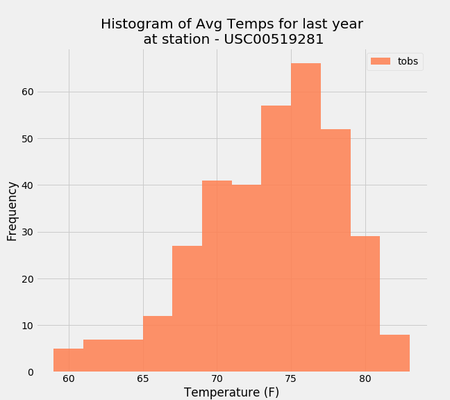

# SQLAlchemy and Flask Challenge - Surfs Up!
#### Submitted by : Sheetal Bongale | UT Data Analysis and Visualization | Feb 15, 2020

#### Objective: 
- Use Python and SQLAlchemy ORM queries with provided [hawaii.sqlite](Resources/hawaii.sqlite) to reflect tables into a new model and perform analysis of Hawaii climate.
- Build a Flask Web app using the served queries that will return JSONified query results from API endpoints.

Technologies Used: `SQLAlchemy`, `Pandas`, `Matplotlib` and `FLASK`

This challenge is done in 2 steps:
- Climate Analysis using SQLAlchemy and Python - [climate_analysis.ipynb](climate_analysis.ipynb)

- Design a Flask API Web Climate App - [app.py](app.py)

- - -
## Step 1 - Climate Analysis and Exploration

To begin, use Python and SQLAlchemy to do basic climate analysis and data exploration of your climate database. All of the following analysis should be completed using SQLAlchemy ORM queries, Pandas, and Matplotlib.

Set-up:
* Used SQLAlchemy `create_engine` to connect to your sqlite database.
* Used SQLAlchemy `automap_base()` to reflect your tables into classes and save a reference to those classes called `Station` and `Measurement`.

### Precipitation Analysis

* Designed a query to retrieve the last 12 months of precipitation data.
* Filtered only the `date` and `prcp` values.
* Loaded the query results into a Pandas DataFrame and set the index to the date column.
* Sorted the DataFrame values by `date`.
* Plot the results using the DataFrame `plot` method.
* Used Pandas to print the summary statistics for the precipitation data.
    

### Station Analysis

* Designed a query to calculate the total number of stations.
* Designed a query to find the most active stations.
* Listed the stations and observation counts in descending order.
* Found out which station has the highest number of observations.
* Designed a query to retrieve the last 12 months of temperature observation data (tobs).
* Filter by the station with the highest number of observations.
* Plot the results as a histogram with `bins=12`.
    

### Temperature Analysis

* Defined a function called `calc_temps` that will accept a start date and end date in the format `%Y-%m-%d` and return the minimum, average, and maximum temperatures for that range of dates.
* Used the `calc_temps` function to calculate the min, avg, and max temperatures for your trip using the matching dates from the previous year (i.e., use "2017-01-01" if your trip start date was "2018-01-01").
* Plot the min, avg, and max temperature from your previous query as a bar chart.

    

### Daily Rainfall Average.

* Calculated the rainfall per weather station using the previous year's matching dates.
* Calculated the daily normals. Normals are the averages for the min, avg, and max temperatures.
* Defined a function called `daily_normals` that will calculate the daily normals for a specific date. This date string will be in the format `%m-%d`. 
* Created a list of dates for your trip in the format `%m-%d`. Use the `daily_normals` function to calculate the normals for each date string and append the results to a list.
* Loaded the list of daily normals into a Pandas DataFrame and set the index equal to the date.
* Used Pandas to plot an area plot (`stacked=False`) for the daily normals.

  
  
- - -

## Step 2 - Climate App

- Design a Flask API based on the queries that were developed in step 1.
- Used FLASK to create your routes.
- Used Flask `jsonify` to convert your API data into a valid JSON response object.

### Following Routes were defined:

* `/`
  * Home page.

* `/api/v1.0/precipitation`
  * Convert the query results to a Dictionary using `date` as the key and `prcp` as the value.
  * Return the JSON representation of your dictionary.

* `/api/v1.0/stations`
  * Return a JSON list of stations from the dataset.

* `/api/v1.0/tobs`
  * query for the dates and temperature observations from a year from the last data point.
  * Return a JSON list of Temperature Observations (tobs) for the previous year.

* `/api/v1.0/<start>` and `/api/v1.0/<start>/<end>`
  * Return a JSON list of the minimum temperature, the average temperature, and the max temperature for a given start or start-end range.
  * When given the start only, calculate `TMIN`, `TAVG`, and `TMAX` for all dates greater than and equal to the start date.
  * When given the start and the end date, calculate the `TMIN`, `TAVG`, and `TMAX` for dates between the start and end date inclusive.

- - -

